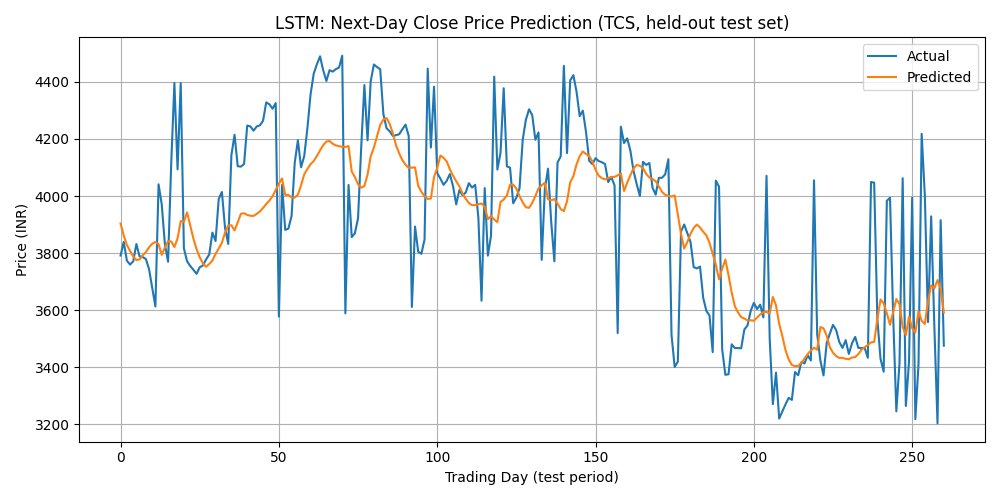
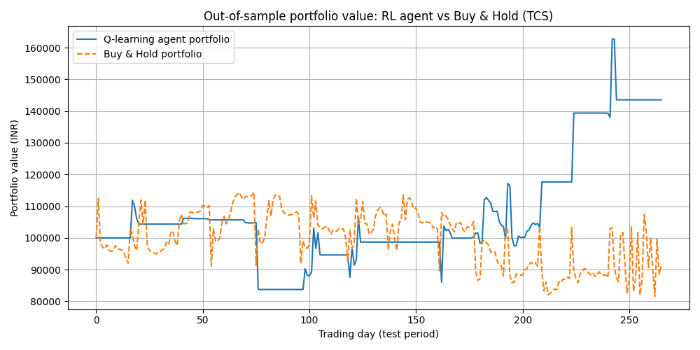

# Stock Market Prediction using ML & Reinforcement Learning

**WnCC, IIT Bombay** — Summer of Code, May–Jun '25

A project exploring how far classical ML, deep learning, and reinforcement learning can go in predicting next-day stock prices/direction on Indian equities (NSE), and in learning a trading policy directly from market data.

---

## Overview

The project is split into two notebooks:

| Notebook | Contents |
|---|---|
| [`SOC.ipynb`](./SOC.ipynb) | Data collection (`yfinance`), Linear Regression, Logistic Regression, KNN, 1D-CNN (regression), LSTM (regression) |
| [`Stock_Prediction_Part2_LSTM_and_RL.ipynb`](./Stock_Prediction_Part2_LSTM_and_RL.ipynb) | LSTM (revisited on NSE data), and a **Q-learning Reinforcement Learning trading agent** |

Stocks used: **Reliance Industries (RELIANCE.NS)**, **State Bank of India (SBIN.NS)**, **Tata Consultancy Services (TCS.NS)** — 5+ years of daily OHLCV data via Yahoo Finance.

---

## Problem Statement

Given a stock's recent price and volume history, how well can machine learning:
1. Predict the **next day's closing price** (regression)
2. Predict the **direction of movement** — up or down (classification)
3. Learn a **trading policy** — when to buy, hold, or sell — directly, using reinforcement learning

---

## Approach

Models were benchmarked in increasing order of complexity, from simple linear baselines to sequence-aware deep learning to a decision-learning RL agent:

1. **Linear Regression** — predicts next-day close price from `Open, High, Low, Close, Volume`
2. **Logistic Regression** — predicts binary direction (up/down)
3. **KNN Classifier** — direction prediction, swept over K = 3, 5, 7, 9
4. **1D-CNN** — sliding-window convolution over a 10–30 day lookback to capture local price patterns
5. **LSTM** — gated recurrent memory over the same lookback window, as a sequence-native alternative to the CNN
6. **Q-Learning RL Agent** — learns a Buy/Hold/Sell policy via trial-and-reward (Bellman updates), evaluated against a Buy & Hold benchmark

All models used **chronological (non-shuffled) train/test splits** to avoid lookahead bias, since shuffling time-series data before splitting leaks future information into training.

---

## Results

| Model | Task | Metric | Result |
|---|---|---|---|
| Linear Regression | Next-day price (TCS) | RMSE | ₹240.8 (≈7.6% of avg. price) |
| Logistic Regression | Direction (AAPL) | Accuracy | 44% |
| KNN (best K=9) | Direction (AAPL) | Accuracy | 54% |
| 1D-CNN | Next-day price | MSE | Loss converged steadily over training |
| LSTM | Next-day price (TCS) | RMSE | ₹228.1 (≈7.2% of avg. price) |
| CNN (direction, k-fold CV) | Direction (pooled: RELIANCE+SBIN+TCS) | Accuracy | 51.9% ± 2.2% (5-fold TimeSeriesSplit) |
| **Q-Learning Agent** | Buy/Hold/Sell policy (TCS, out-of-sample) | Portfolio return | **+43.6%** vs. **−8.6%** Buy & Hold |

**Key takeaway:** classical models and even deep learning direction-classifiers hover close to a coin-flip on raw OHLCV data — consistent with the Efficient Market Hypothesis, which says publicly available price/volume history is already priced in. The more interesting result is the **RL agent**, which — even with a small, hand-crafted state space — learned a policy that meaningfully outperformed passive holding on held-out data. This should be read as a promising proof-of-concept rather than a deployable trading strategy (no transaction costs or slippage were modeled).

Sample outputs:





---

## Key ML Concepts Used

- **Feature scaling** (`MinMaxScaler`, fit on train data only, to avoid leakage)
- **Windowed sequence construction** for CNN/LSTM inputs (10–30 day lookback)
- **Dropout & Early Stopping** for regularization against overfitting
- **Time-series-aware cross-validation** (`TimeSeriesSplit`) instead of shuffled k-fold, to respect chronological order
- **Confusion matrices** (visualized with seaborn) alongside accuracy, since accuracy alone is misleading under class imbalance
- **Technical indicators** as engineered features: SMA, EMA, RSI, Returns
- **Q-learning** (tabular reinforcement learning): state discretization (trend × RSI bucket × position), epsilon-greedy exploration, and the Bellman update rule

---

## Tech Stack

- `yfinance` — data collection
- `pandas`, `numpy` — data wrangling
- `scikit-learn` — Linear/Logistic Regression, KNN, scaling, metrics, cross-validation
- `tensorflow` / `keras` — CNN, LSTM
- `matplotlib`, `seaborn` — visualization

---

## Repository Structure

```
.
├── SOC.ipynb                                  # Part 1: data collection, Linear/Logistic/KNN/CNN/LSTM
├── Stock_Prediction_Part2_LSTM_and_RL.ipynb   # Part 2: LSTM + Q-learning RL agent
├── RELIANCE_Yahoo_Historical_Python.csv       # NSE historical data
├── SBIN_Yahoo_Historical_Python.csv
├── TCS_Yahoo_Historical_Python.csv
├── lstm_prediction.png
├── rl_vs_buyhold.png
├── q_table_heatmap.png
└── README.md
```

---

## Running Locally

```bash
pip install yfinance pandas numpy scikit-learn tensorflow matplotlib seaborn jupyter

jupyter notebook SOC.ipynb
# or
jupyter notebook Stock_Prediction_Part2_LSTM_and_RL.ipynb
```

> Note: if you don't have internet access to Yahoo Finance, both notebooks can be pointed at the included CSVs instead of calling `yfinance.download()` directly.

---

## Limitations & Future Work

- No transaction costs, slippage, or liquidity constraints modeled in the RL backtest
- RL state space is small and hand-crafted (trend/RSI/position); a **Deep Q-Network (DQN)** would allow the agent to work directly with richer, continuous market state
- Direction-classification accuracy (~52%) suggests raw OHLCV alone has limited directional signal; incorporating fundamental features (P/E, EPS, ROE) or sentiment/news data is a natural next step
- Backtests are on a single stock (TCS) for RL and a limited 3-stock universe overall; broader validation across more tickers and market regimes (bull/bear/sideways) would strengthen the conclusions

---

## Acknowledgements

Built as part of **WnCC (Web and Coding Club), IIT Bombay** — Summer of Code, May–Jun 2025.
